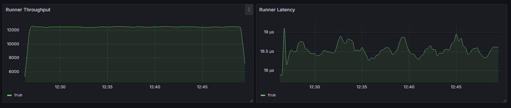
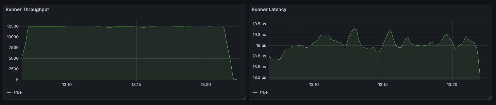
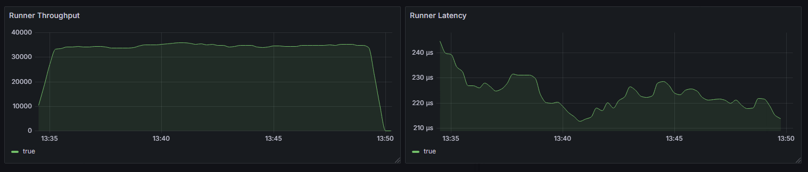

Performance Testing for Kafka (produce messages)

---

#### Configuration Guideline

- `plans/test-plan.yaml`
  - `vus`: number of virtual users, default = 0
  - `duration`: the time this script will be run, default = 0s
  - `iterations`: the total number of messages will be handled, default = -1 meaning not limit number of requests.
  - `producer.topic`: the topic name that message will be sent to. (required)


- `kafka-producer.yaml`
  - `bootstrap-servers`: the kafka broker endpoints (required)

---

## Testing Results

### Cluster Information

- 3 KRaft Controllers (each, 500m -> 1 CPU, and 1Gi -> 2Gi RAM)
- 3 Brokers (each, 100Gi, 1 -> 2 CPU, and 2Gi -> 4Gi RAM)
- protocol: PLAINTEXT
- metric exporters: jxm-exporter, kafka-exporter.

### Scenario 1: Base

- config
  ```yaml
    partitions: 1 (meaning all requests to one broker that holds this leader partition)
    replication.factor: 1 (not recommended, I just wanna do this basic case for chart data)
    min.insync.replicas: 2 (not effect if replication.factor = 1)
    acks: all (should be all if working on critical system)
    compression.type: none
    
    virtual.users: 1 (no of producers = vus / 2000, min = 1, max = 100)
    durations: 1h (but I stopped it by manual)
    iterations: -1 (not limit)
  ```
- small message (4 fields, ~100 bytes/message)
  ```json
    {
      "id": { "_type": "uuid" },
      "name": { "_type": "constant", "_value": "name" },
      "description": { "_type": "random_string", "_length": 40 },
      "value": { "_type": "random_int", "_min": 0, "_max": 100 },
      "timestamp": { "_type": "now", "_format": "epoch_millis" }
    }
  ```
- result (12k5 rps, 18.5 microseconds)
  

### Scenario 2: Add acknowledgment constraints from Scenario 1

- config
  ```yaml
    partitions: 1 (meaning all requests to one broker that holds this leader partition)
    replication.factor: 3 (full replication as brokers.no = replication.factor)
    min.insync.replicas: 2  (recommended, set it 3 if requiring more durability but slower)
    acks: all (should be all if working on critical system)
    compression.type: none
  
    virtual.users: 1 (no of producers = vus / 2000, min = 1, max = 100)
    -> producers: 1
    durations: 15m
    iterations: -1 (not limit)
  ```
- small message as Scenario 1 (4 fields, ~100 bytes/message)

- result (12k5 rps, 19 microseconds)
  - higher latency than scenario 1 as waiting acks=all by as least min.isr=2 up to 3)
  
  

### Scenario 3: Up VUs to 10 from Scenario 2

- config
  ```yaml
    partitions: 1 (meaning all requests to one broker that holds this leader partition)
    replication.factor: 3 (full replication as brokers.no = replication.factor)
    min.insync.replicas: 2  (recommended, set it 3 if requiring more durability but slower)
    acks: all (should be all if working on critical system)
    compression.type: none
  
    virtual.users: 10 (no of producers = vus / 2000, min = 1, max = 100)
    -> producers: 1
    durations: 15m
    iterations: -1 (not limit)
  ```
- small message as Scenario 1 (4 fields, ~100 bytes/message)

- result (35k rps, 220 microseconds)
  

### Scenario 4: Up VUs to 100 from Scenario 2

- config
  ```yaml
    partitions: 1 (meaning all requests to one broker that holds this leader partition)
    replication.factor: 3 (full replication as brokers.no = replication.factor)
    min.insync.replicas: 2  (recommended, set it 3 if requiring more durability but slower)
    acks: all (should be all if working on critical system)
    compression.type: none
  
    virtual.users: 100 (no of producers = vus / 2000, min = 1, max = 100)
    -> producers: 1 (with higher vus, the buffer memory on this producer is more useful)
    durations: 15m
    iterations: -1 (not limit)
  ```
- small message as Scenario 1 (4 fields, ~100 bytes/message)

- result (x rps, x microseconds)